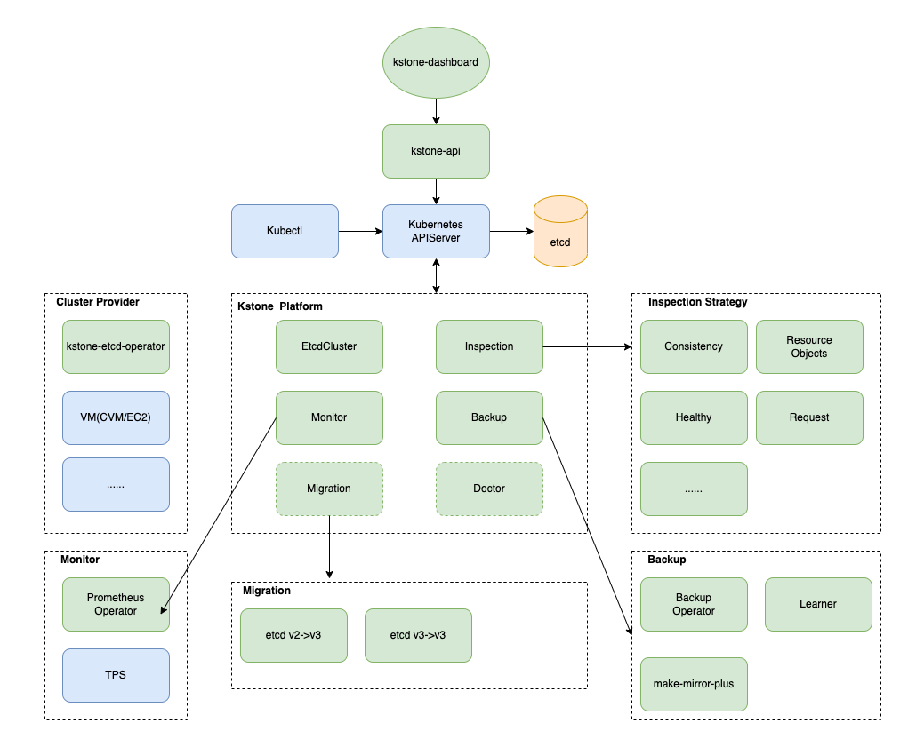

# Kstone

<div align=center></div>

------

[English](README.md)

Kstone 是一个针对 [etcd](https://github.com/etcd-io/etcd) 的全方位运维解决方案，提供集群管理（关联已有集群、创建新集群等)、监控、备份、巡检、数据迁移、数据可视化、智能诊断等一系列特性。

Kstone 将帮助你高效管理etcd集群，显著降低运维成本、及时发现潜在隐患、提升k8s etcd存储的稳定性和用户体验。

------

## 特性

Kstone 是一个 [etcd](https://github.com/etcd-io/etcd) 的治理平台，它有以下特点：

* 轻量，安装方便
* 支持导入已有集群、创建新etcd集群
* 支持Prometheus监控，内置丰富的etcd Grafana面板图
* 支持多种数据备份方式(分钟级备份到对象存储、部署Learner实时备份)
* 支持多种巡检策略（数据一致性、健康度、写请求、资源对象数等)
* 支持可视化查看etcd数据（特别支持Kubernetes资源对象数据的可视化查看）
* 极大简化运维成本，在集群导入、创建完成时，即可自动开启监控、备份、巡检等特性

## 核心架构

Kstone 由5个组件组成：
- kstone-etcdcluster-controller
- kstone-etcdinspection-controller
- kstone-etcd-operator
- kstone-api
- kstone-dashboard



## 组件

### kstone-etcdcluster-controller

* 关联已有集群，如已有的kubernetes集群etcd 
* 根据EtcdCluster资源所描述的集群元信息，调用ClusterProvider创建、更新、删除etcd集群
* 根据EtcdCluster资源所描述的特性开关，开启或关闭监控、备份、巡检等特性(创建EtcdInspection资源)

### kstone-etcdinspection-controller

* 实时监听EtcdInspection资源，调用后端FeatureProvider执行巡检

### [kstone-etcd-operator](https://github.com/tkestack/kstone-etcd-operator)

kstone-etcd-operator提供丰富的集群管理能力(此组件也即将开源)。

### kstone-api

* 提供了一系列etcd集群管理的api给web前端使用

### [kstone-dashboard](https://github.com/tkestack/kstone-dashboard)

Kstone 提供的WEB管理系统如下：


## 安装

请阅读[部署文档](charts/README_CN.md)，
你可通过Helm快速安装Kstone。

## 开发

### 构建
```
mkdir -p ~/tkestack
cd ~/tkestack
git clone https://github.com/tkestack/kstone
cd kstone
make
```

## 联系方式

如果您有任何疑问或需要支持，请随时与我们联系：
- [Slack](https://join.slack.com/t/w1639233173-qqx590963/shared_invite/zt-109muo6i9-0kTUQphSVFlwOSW7CgtrGw)
- 微信群

<div align="center">
  
</div>

## 社区

欢迎大家提交issue和pull request来一起完善、提升Kstone。

## License

Kstone is licensed under the Apache License, Version 2.0. See [LICENSE](LICENSE) for the full license text.
