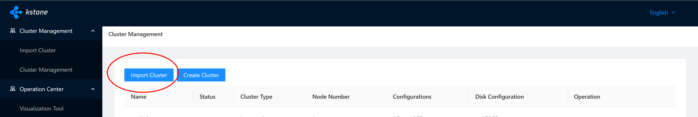
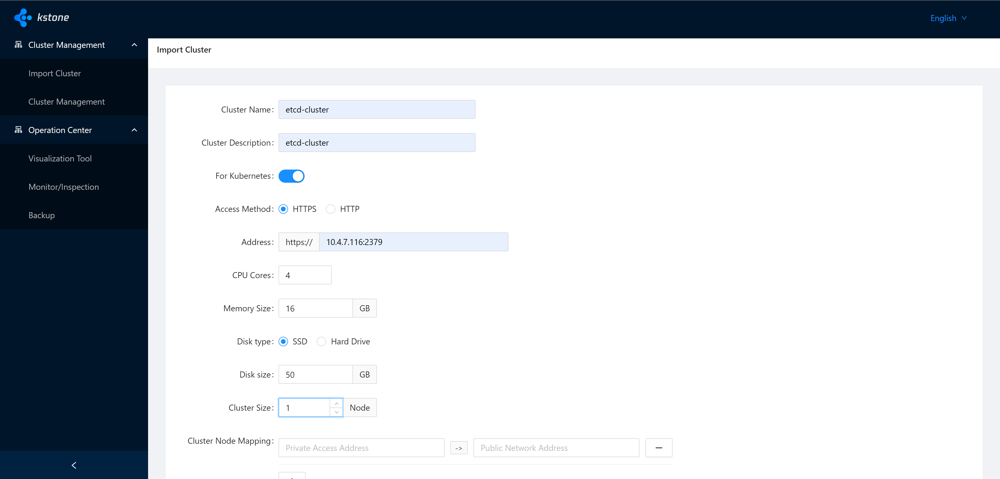
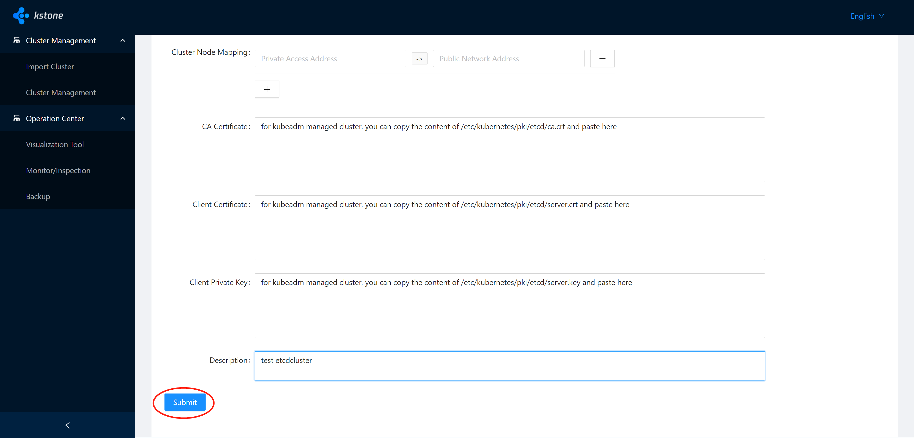
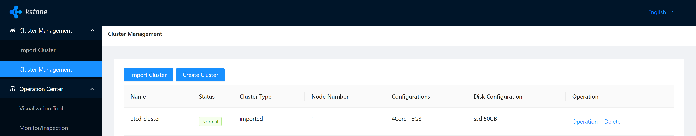
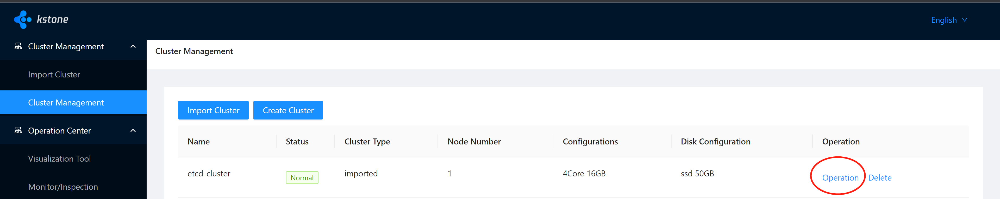
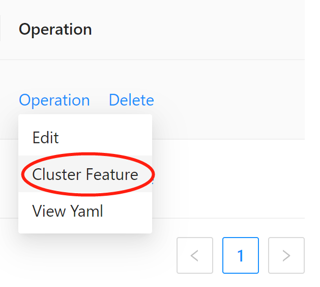
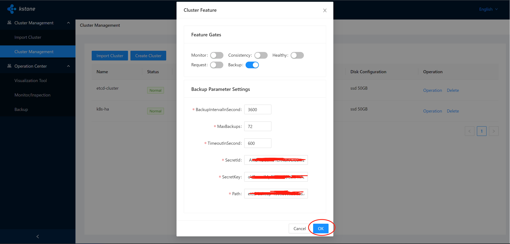
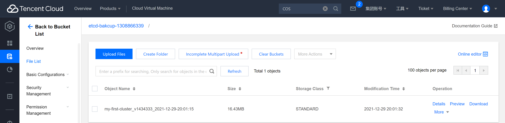

# Backup guide for Tencent COS

[中文](cos_zh.md)
## 1 Preparation

+ Prerequisites

  - Kubernetes Cluster with kstone installed.
  - Tencent cloud account with COS feature enabled. 

  

# 2 Guide

### Step 1: Access kstone-dashboard UI and Click "Import Cluster":

### Step 2: Associate etcd cluster with kstone:

in this document we will use kubeadm managed etcd cluster 

fill the content and click "Submit"

Cluster Name : etcd cluster name，uniqueKey

Cluster Description : description about this cluster

For Kubernetes : Is this cluster used by kubernetes

Access Method :  the access method of etcd, if choose HTTPS, etcd certificate and key should be provided.

CPU Cores :  single node's CPU, unit: Core

Memory Size : single node's mem, unit: GiB

Disk type : disk type, CLOUD_SSD/CLOUD_PREMIUM/CLOUD_BASIC

Disk size : single node's disk size, unit: GB

Cluster Size : etcd cluster member count: support 1, 3, 5, 7

Cluster Node Mapping : the private and public address of etcd cluster, omit if not used

CA Certificate : the ca certificate of etcd cluster

Client Certificate :  the client certificate of etcd cluster

Client Private Key : the client key of etcd cluster

Description : etcd description

### Step3: Enable BACKUP feature

now we have a working etcd cluster, it's time for us to enable the backup feature.

+ We need to get the Tencent cloud COS SecretId and SecretKey and bucket first 
  - open and login to  the Tencent cloud  COS website: https://console.cloud.tencent.com/cos5
  - if not enabled, please enable this feature
  - create a bucket and save the bucket URL path
  - open and login to the Tencent cloud cam website: https://console.cloud.tencent.com/cam
  - create a user with QcloudCOSDataFullControl permission  and save the secretId and SecretKey

+ Let's head back to the kstone-dashboard

  - click "Operation"

  - click "Cluster Feature"

  - toggle "Backup:"

  - fill below parameters

  - BackupIntervalInSecond determines how often the backup-operator will start an etcd backup job

  - MaxBackups is the maximum backup count you want to keep in the COS bucket, if your backup file count exceeds this number, backup-operator will delete old file by time order.

  - TimeoutInSecond is the timeout second for backup-operator

  - SecretId is the secret id copied from the previous step

  - SecretKey is the secret key copied from the previous step

  - Path:

  # important!!! 

  you need to fill this parameter without https:// and with / and backup file prefix you want

  if your COS bucket URL  address is https://etcd-bakcup-XXXXXXX.cos.ap-guangzhou.myqcloud.com and you want your backup file prefix to be like my-first-cluster, you need to fill the path like below:

  #### etcd-bakcup-XXXXXXX.cos.ap-guangzhou.myqcloud.com/my-first-cluster

+ wait BackupIntervalInSecond  and check the COS bucket

You will find an etcd backup file with the prefix you specified in the previous step.