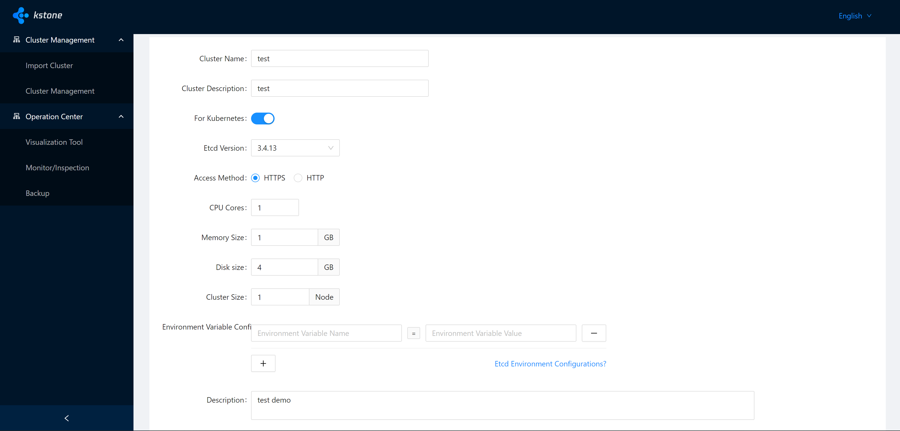

# Kstone Installation	

## 1 Preparation

- Prerequisites
  - Kubernetes version is between 1.14 and 1.20.
  - The version of Prometheus Operator is v0.49.0.
- Requirements：
  - For production environment (recommended): Worker >= 4 vCPU 8 GB of Memory.
  - For test environment (minimum): Worker >= 2 vCPU 2 GB of Memory.

## 2 Install kubeadm and CNI Plugin

you can check below guide

https://kubernetes.io/docs/setup/production-environment/tools/kubeadm/create-cluster-kubeadm/

## 3 Deploy

- 3.1 Modify Helm Configuration

  ### Step 1：

  - Install helm:

  Please refer to [helm installation](https://helm.sh/docs/intro/install/) or just directly download and install

```bash
  wget https://get.helm.sh/helm-v3.7.2-linux-amd64.tar.gz 
  tar -zxvf helm-v3.7.2-linux-amd64.tar.gz
  mv linux-amd64/helm /usr/local/bin/helm
```
  
  - Install git:
  
```bash
    yum -y install git
```

  - Download Helm Repo:
  
```bash
  git clone git@github.com:tkestack/kstone.git
  cd kstone
  cd ./charts
```

####       Step 2：

- Create Admin TOKEN for dashboard-api to access Kubernetes

```bash
  kubectl create serviceaccount kube-admin -n kube-system
  kubectl create clusterrolebinding kube-admin --clusterrole=cluster-admin --serviceaccount=kube-system:kube-admin
```

- Get Admin TOKEN from Kubeadm cluster

```
kubectl get secrets -o jsonpath="{.items[?(@.metadata.annotations['kubernetes\.io/service-account\.name']=='kube-admin')].data.token}" -n kube-system|base64 --decode
```

- Fill in the TOKEN of the cluster to deploy.

```
// charts/charts/dashboard-api/values.yaml

kube:
  token: $token
  target: kubernetes.default.svc.cluster.local:443
```

- Requirements：
  - $token is the access credential TOKEN of the cluster to be deployed.
  - $token needs to have access to all resources in the cluster.

#### Step 3: Using the existing Prometheus Operator (optional)

- Set `prometheusOperator.enabled=false` in the file `charts/charts/kube-prometheus-stack/values.yaml`.
- Set `prometheus.enabled=false` in the file `charts/charts/kube-prometheus-stack/values.yaml`.
- Modify the file: `charts/charts/grafana/templates/configmap.yaml`, replace `http://{{ .Release.Name }}-prometheus-prometheus.{{ .Release.Namespace }}.svc.cluster.local:9090` to the query URL from the existing Prometheus Operator.

### 3.2 Install

- Create kstone namespace

```bash
kubectl create ns kstone
```

- Helm install for production environment

```bash
cd charts/
helm install kstone . -n kstone -f values.yaml
```

or

- Helm install for test environment

```bash
cd charts/
helm install kstone . -n kstone -f values.test.yaml
```

- Delete Ingress Rule

```bash
  kubectl delete ingress kstone -n kstone
```

- Create a new Ingress Rule

```yaml
cat <<EOF | kubectl apply -f -
apiVersion: networking.k8s.io/v1
kind: Ingress
metadata:
  name: kstone-ingress
  namespace: kstone
  annotations:
    kubernetes.io/ingress.class: nginx
spec:
  rules:
    - http:
        paths:
          - path: /
            pathType: Prefix
            backend:
              service:
                name: kstone-dashboard
                port:
                  number: 80
          - path: /apis
            pathType: Prefix
            backend:
              service:
                name: kstone-dashboard-api
                port:
                  number: 80
          - path: /grafana
            pathType: Prefix
            backend:
              service:
                name: kstone-grafana
                port:
                  number: 80
EOF
```

- Install nginx-ingress

  check https://kubernetes.github.io/ingress-nginx/deploy/#quick-start  or just

```bash
  kubectl apply -f https://raw.githubusercontent.com/kubernetes/ingress-nginx/controller-v1.1.0/deploy/static/provider/baremetal/deploy.yaml
```

- Expose Ingress Port

```bash
kubectl port-forward deployment/ingress-nginx-controller 8080:80 --namespace ingress-nginx --address 0.0.0.0
```

  or You can directly access the NodePort of ingress-nginx-controller

```bash
[root@kstone charts]# kubectl get svc -n ingress-nginx
NAME                                 TYPE        CLUSTER-IP      EXTERNAL-IP   PORT(S)                      AGE
ingress-nginx-controller             NodePort    10.104.79.160   <none>        80:30700/TCP,443:31221/TCP   40h
ingress-nginx-controller-admission   ClusterIP   10.105.48.164   <none>        443/TCP        
```

- Visit kstone dashboard `http://<VM IP address>:8080` or the ingress NodePort address in the browser  

- ### important: Do not access the dashboard directly!!!


- Create an ETCD cluster



- Cluster is Running


### 3.3 Update

- Helm upgrade for production environment

```bash
cd charts

helm upgrade kstone . -n kstone -f values.yaml
```

or

- Helm upgrade for test environment

```bash
cd charts

helm upgrade kstone . -n kstone -f values.test.yaml
```

### 3.4 Uninstall

```bash
helm uninstall kstone -n kstone

kubectl delete crd alertmanagerconfigs.monitoring.coreos.com
kubectl delete crd alertmanagers.monitoring.coreos.com
kubectl delete crd podmonitors.monitoring.coreos.com
kubectl delete crd probes.monitoring.coreos.com
kubectl delete crd prometheuses.monitoring.coreos.com
kubectl delete crd prometheusrules.monitoring.coreos.com
kubectl delete crd servicemonitors.monitoring.coreos.com
kubectl delete crd thanosrulers.monitoring.coreos.com
kubectl delete crd etcdclusters.kstone.tkestack.io
kubectl delete crd etcdinspections.kstone.tkestack.io
```

- Uninstall Kubeadm 

  https://kubernetes.io/docs/reference/setup-tools/kubeadm/kubeadm-reset/

