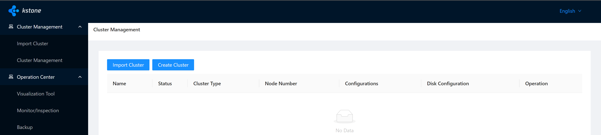

# Kstone Installation


## 1 Preparation

- Prerequisites
  - Kubernetes version is between 1.14 and 1.20.
  - The version of Prometheus Operator is v0.49.0.
- Requirements：
  - For production environment (recommended): Worker >= 4 vCPU 8 GB of Memory.
  - For test environment (minimum): Worker >= 2 vCPU 2 GB of Memory.
  - Can access the managed etcd.

## 2 Install Minikube

#### Step 1：

- Switch to non-root User 
```shell
adduser kstone
# set password for kstone user
passwd kstone

su - kstone

sudo groupadd docker

sudo usermod -aG docker $USER

# Re-Login and Restart the Docker Server
systemctl restart docker
```

#### Step 2：
- [Install Minikube](https://minikube.sigs.k8s.io/docs/start/) (e.g. Linux amd64)
    - Requirements：version <= 1.20.x
```shell
VERSION=v1.20.0
curl -LO https://github.com/kubernetes/minikube/releases/download/${VERSION}/minikube-linux-amd64
sudo install minikube-linux-amd64 /usr/local/bin/minikube
minikube start --driver=docker
```


- Alias `minikube kubectl`
```shell
alias kubectl="minikube kubectl --"
```
#### Step 3:

- Deploy ingress controller
```shell
minikube addons enable ingress
```

## 3 Deploy

### 3.1 Modify Helm Configuration

#### Step 1：
- Install helm:

Please refer to [helm installation](https://helm.sh/docs/intro/install/)

- Download Helm Repo:

``` shell
git clone -b release-0.2 git@github.com:tkestack/kstone.git
cd ./charts
```

#### Step 2：

- Get Admin TOKEN from Minikube cluster

```shell
kubectl get secrets -o jsonpath="{.items[?(@.metadata.annotations['kubernetes\.io/service-account\.name']=='default')].data.token}" -n kube-system|base64 --decode
```

- Fill in the TOKEN of the cluster to deploy.

``` yaml
// charts/charts/dashboard-api/values.yaml

kube:
  token: $token
  target: kubernetes.default.svc.cluster.local:443
```

- Requirements：
    - $token is the access credential TOKEN of the cluster to be deployed.
    - $token needs to have access to all resources in the cluster.

#### Step 3: Using the existing Prometheus Operator (optional)

- Set `prometheusOperator.enabled=false` in the file `charts/charts/kube-prometheus-stack/values.yaml`.
- Set `prometheus.enabled=false` in the file `charts/charts/kube-prometheus-stack/values.yaml`.
- Modify the file: `charts/charts/grafana/templates/configmap.yaml`, replace `http://{{ .Release.Name }}-prometheus-prometheus.{{ .Release.Namespace }}.svc.cluster.local:9090` to the query URL from the existing Prometheus Operator.

### 3.2 Install

- Create kstone namespace

``` shell
kubectl create ns kstone
```

- Helm install for production environment
```shell
cd charts/
helm install kstone . -n kstone -f values.yaml
```

or

- Helm install for test environment

```shell
cd charts/
helm install kstone . -n kstone -f values.test.yaml
```

- Create Ingress Rule
  
```shell
cat <<EOF | kubectl apply -f -
apiVersion: networking.k8s.io/v1
kind: Ingress
metadata:
  name: kstone-ingress
  namespace: kstone
spec:
  rules:
    - http:
        paths:
          - path: /
            pathType: Prefix
            backend:
              service:
                name: kstone-dashboard
                port:
                  number: 80
          - path: /apis
            pathType: Prefix
            backend:
              service:
                name: kstone-dashboard-api
                port:
                  number: 80
          - path: /grafana
            pathType: Prefix
            backend:
              service:
                name: kstone-grafana
                port:
                  number: 80
EOF
```

- Expose Ingress Port
```shell
kubectl port-forward deployment/ingress-nginx-controller 8080:80 --namespace ingress-nginx --address 0.0.0.0
```

- Visit kstone dashboard `http://<VM IP address>:8080` in the browser



- Create an ETCD cluster


- Cluster is Running


### 3.3 Update

- Helm upgrade for production environment

``` shell
cd charts

helm upgrade kstone . -n kstone -f values.yaml
```

or

- Helm upgrade for test environment

``` shell
cd charts

helm upgrade kstone . -n kstone -f values.test.yaml
```

### 3.4 Uninstall

``` shell
helm uninstall kstone -n kstone

kubectl delete crd alertmanagerconfigs.monitoring.coreos.com
kubectl delete crd alertmanagers.monitoring.coreos.com
kubectl delete crd podmonitors.monitoring.coreos.com
kubectl delete crd probes.monitoring.coreos.com
kubectl delete crd prometheuses.monitoring.coreos.com
kubectl delete crd prometheusrules.monitoring.coreos.com
kubectl delete crd servicemonitors.monitoring.coreos.com
kubectl delete crd thanosrulers.monitoring.coreos.com
kubectl delete crd etcdclusters.kstone.tkestack.io
kubectl delete crd etcdinspections.kstone.tkestack.io
```
- Uninstall Minikube
```shell
minikube stop && minikube delete
```