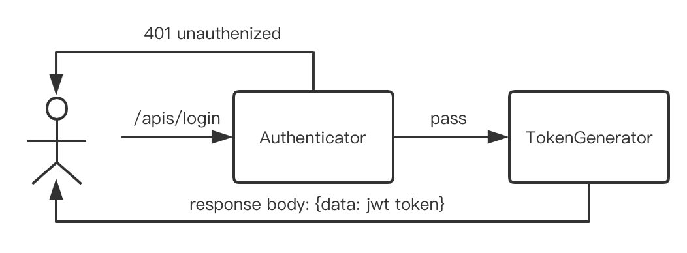
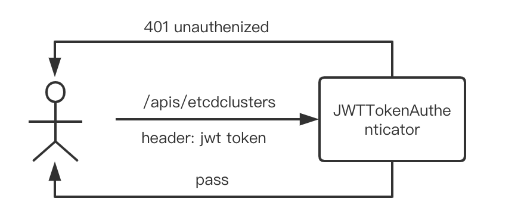

# kstone-api Supports Authentication

## Motivation

Kstone has become a popular solution for etcd management. Due to lack of authentication ability, it has safety vulnerability and is not recommended using in production environment. To improve safety features of kstone, we'd like to support authentication in kstone.

## Goals

* Designed to support multiple authentication plugins.
* Strong security (password encryption, token expiration time, password reset only, etc.).
* Built-in username/password authentication, the default is based on bearer token authentication (jwt).
 
## Non-Goals

* Implement a complex RBAC authentication system.
* Implement a complete user management system(only create an admin user by default).

## Use Cases

* Visiting [kstone-dashboard](https://github.com/tkestack/kstone-dashboard) login page to authenticate.
* Any requests to access kstone-api without authentication will directly return a HTTP 401 Unauthorized
error.

### Bear Token Authentication

- Users use their username and password to login.
- The token authenticator generates a bear token set in response body.
- Users send request with bear token request header, the token authenticator verifies if the token is valid.

### External Auth

Users configure their own authentication system (e.g. ldap, oidc), and use their custom authentication system to verify identity.

## Proposal

In order to implement login feature, we develop an authentication module in kstone-api. It supports not only basic auth(username/password authentication) by default but also other authentication protocols.

## Design Details

### Authentication Process

#### 1. Login Process



- First time login, POST request will be sent to kstone-api, URL path `/apis/login`.
- User login with default username and password.

Request example:

```json
{
  "username":"admin",
  "password":"adm1n@kstone.io"
}
```

Response example:

```json
{
  "username":"admin",
  // this will be true when login with default username and password
  "reset_password": true,
  "data":"eyJhbGciOiJSUzI1N.xxx.xxx"
}
```
- **Authenticator**: Compare user and password with `kstone-api-user` configmap configuration.

- **TokenGenerator**: Generate a JWT token for users and put it in response body.

- If user login with default username and password, the response body will contain `"reset_password": true`, users must reset the password.

#### 2. JWT Token Authentication Process



- **JWTTokenAuthenticator**: Verify JWT Token from request header.

> If user sends request with JWT token header, **JWTTokenAuthenticator** middleware will only verify the token until it is expired.

### Authentication Interface

- Authentication Request, Token and TokenGenerator Interface

```go

// Token checks a string value against a backing authentication store and
// returns a Response or an error if the token could not be checked.
type Token interface {
    AuthenticateToken(ctx context.Context, token string) (*Response, bool, error)
}

// TokenGenerator generates tokens
type TokenGenerator interface {
    GenerateToken(ctx context.Context, username string, password string) (string, error)
}

// Request attempts to extract authentication information from a request and
// returns a Response or an error if the request could not be checked.
type Request interface {
    AuthenticateRequest(ctx *gin.Context) (*Response, bool, error)
}

```

- Store Interface

```go
// Store defines auth user/password storage interface
type Store interface {
	// UserGet gets a user
	UserGet() User
	// UserAdd adds a user
	UserAdd(user User) error
	// UserDelete deletes a user
	UserDelete(username string) error
	// UserList lists users
	UserList() []User
	// UserChangePassword changes a password of a user
	UserChangePassword(username, password string) error
}
```

### Bear Token Authentication

#### Auth Configuration

By default, we create a `kstone-api-key` secret and `kstone-api-user` configmap in kstone namespace.

- `kstone-api-key` secret specifies private key:
```yaml
apiVersion: v1
data:
  private.key: LS0tLS1CRUdJTiBSU0EgUFJJVkFURSBLRVktLS0tLQpNSUlFcFFJQkFBS0NBUUVBeURuTHlyS0t4d1lhQVF1VDhSRVZ0bWR1VDYyV0xYTGIvUEs4bStJZG8yd3U1L1oxCmpCTVBIcWFzMjdabGlaeXF5bFVWZ3FsSUxNZUxPYlFtY0JvTUdGNkxuemVreHdEYVdmNTBRYW5JeTNSdFR4UVYKaEdIMnc0ZS8yQnI2NXlucUh6N0NZSy9VUHhWSWRTYWZaZ08vM0VGTWZVZVZRV0RWRWJCaTZWSW5hZzdsQjlRUQo2Q2tPTFM2ZFl5YXJnWWcrWWJZUkliVkVCNmNRTzNvcXJVTzR4OTlpZ3l3Z0Q3dlRReHdOMXB5eHVNbmlRYW5HCkREakludndTdUMxYTlUREdWc0ZXMzU5OUVoeGFuc3FUaUhvMm04YjJwNzdsWFFGYy9Qc1UwNTB6dDgxN1czTVEKbGlQRU5ycUhQTUpTNXhFQkhjdEdzb3Rtc3J6NmNIUklrclFLblFJREFRQUJBb0lCQVFDSDg0NW5aRkdNajUwSwpocVQrTXo2TjZxN2hGUmw2Wkpud3A1VGZOMm91YzU5cHkxUEhONDIxbnpDUndzZ3c1eHFrWlo5RVo5TGs3TnlnCjRxeVN3MnpoQXhsRWs1Q2p1dldIMDVsMm1HVUptRlU4TTRQa3JtdlNHaE51RmV1MUdDV3E3MzhtRFYxTk5CTk4KMEZxODl1RElHZUpvMGprSytrZlNTZlR2UGVRYlF5d3BPdVg3Wmp1RCtLOE9qRzlhWnpNOTYyUERoREJ2VlBCZQpKeXNqV0VqU0d5YWc3NjMza3Y0dWtPeDhycVBRLzJUdStIcElyQTljVXBnVDh6V0UycThxcHdVZzBHY0NuZ21mCnFsZjU1a1lzL1RhMW9iUjNxYVg2bWpKL2dFNlZyUzFpSTc1em5lbkh3Tmp6WExpaE5JL3ZkMXh1QnREV2JLTVUKK0M3bnpPZlZBb0dCQU9vaTNZM2luOGgrTjczYVdyWnIxQ29FNzBFWHg2dFZwdnBTUHJyMmZhUG5UVDBOR1RpUgpsTFJlOEp3WU9nNlgzQjU4SEwxVUtnZ05pT285TS9FSUlMblU0RzdHbDZSTG52NUNBODVtYWJ4Q3JkMTJXeWlpCmVnMy80ODRselFpdDliQ0lFV3VaekcySnBYb2Jzc3FjT0szNjNKKzBtUk1JUDhLTWVVbFlwYVo3QW9HQkFOcnMKU1R6aXhwWm0yYUYrUzNYV0l0TmRjakhMRW1BU1orcVZ6TXRRcHFLUjRlSXlodDNtczRGWmdCSFpxTVMzWTlDLwppdUFQNWJMMTA4NGdtWWJmMjhpRjNyakdhbGdHUkRpaDh6REgyR2pMVitrbE1PUm1GaFRPeDF5SHhTVWVaOEpjCmZ3aG42Y3RxcVRQaE5mQmw0SUV1eklEalZueDdUL09IMkhybDFaUEhBb0dCQU5aeW5LNnFGV05UaDhhU1NtZXYKRjZKczVwNmVJem1ndDlHcXB0NGppaXduWEsxQVpBdFYrL2ZBeFd5VEhBbmx1YTBLVEdCMHlCS2NJdjA0bFd4OAozMHlWMkFKZVR1SWlpVHVrUjB3eXJVSExhT2ZnMGRuRUJ6cnZWejJuamNZWFgyTVRIYkdLS3AxaFoza1NDWTVkCnkrUStVdmpNTnpBaGJCVExDUVBPOTlvbEFvR0FQanhrQ2FvU2VKbGVqemwvTEUybTh0Mmk1Q0x0NDEvNEtNbFQKUWcxNGdjamxKVS9sNVZsN2VHOUFLRkx2VnBVb0RDVVh6dURXRlEwcm5ITEtFbnk3VjRNdk1Pby9PeXowNGdDdwpTUkxYSTl1QzcyWENRM3YrRlFZL3lMOVVQVndxZFNla2VYaEpENm9QMWc3VkxiVllvSUQwWkVPOHg0Q3Exdm1zCmdpdXFqdXNDZ1lFQXI0WVhUWWZQUk9YQXRmN01ETUs5bmVRcHZNUytiMit5RGNhdFM0YitNT0kxY3ViNFFsdDEKMDdWV2RnWnNybTc2bkZ2TDF4SWptREhPZnJPbU1Zd2Y3VGRhYWVIbG1Qa1BvOHc2ZG1lbkdGaHV2Q1lZa3YyagpsS3o2VWhtYzlCNkc4VVlQNzdvWTR5RkhoQU9mVXpTQVF4bEpEV0hzeVA0SmRtZTlYZnNURUU0PQotLS0tLUVORCBSU0EgUFJJVkFURSBLRVktLS0tLQo=
kind: Secret
metadata:
  name: kstone-api-key
  namespace: kstone
type: Opaque
```
- `kstone-api-user` configmap specifies username and password:

```yaml
data:
  # password: bcrypt encryption(e.g. adm1n@kstone.io)
  admin: $2y$10$dgolimSP5PywT3yMaRqppeA5GflVmyf/cWaL6bfmXVk6Rsjlmp0ui
kind: ConfigMap
metadata:
  name: kstone-api-user
  namespace: kstone
```

To customize admin username and password, modify or add the data field in `kstone-api-user` configmap.

> To support multiple users, user can add multiple `username: password` key-value pairs in `kstone-api-user` configmap

#### Encryption && Decryption

Use [`golang.org/x/crypto`](https://pkg.go.dev/golang.org/x/crypto) to compare a **bcrypt hashed password** with its **possible plaintext equivalent**. Returns nil on success, or an error on failure.

- **bcrypt hashed password** stored in `kstone-api-user` configmap.
- **possible plaintext equivalent** is the login password from user.
```go
bcrypt.CompareHashAndPassword(bcryptHashedPassword, plaintextPassword)
```

#### Customize Admin Username, Password or Private Key

- Specify a new username and password(e.g. admin:custom@kstone.io)

```shell
USER=admin
PASSWORD=custom@kstone.io
```
> Password must contain numbers, letters, eight digits or more in length

- Generate a new password hash

```shell
# yum -y install httpd-tools
# e.g. htpasswd -nbBC 10 admin admin
HASH_PASSWORD=`htpasswd -nbBC 10 ${USER} ${PASSWORD}|awk -F ':' '{print $2}'`

```

- Update username and password:

- 1. use `--dry-run=client` option to print out a custom `kstone-api-user` configmap:
```shell
kubectl create configmap -n kstone kstone-api-user --from-literal=${USER}=${HASH_PASSWORD} --dry-run=client -oyaml
```
- 2. replace the default `kstone-api-user` configmap with the new `kstone-api-user` configmap.
    
> If the user forgets the password, please refer to this method to reset the password.

- Generate a new private key

```shell
openssl genrsa -out private.key 2048
```

- Update private key:
  
- 1. use `--dry-run=client` option to print out a custom `kstone-api-key` secret:
```shell
kubectl create secret generic -n kstone kstone-api-key --from-file=private.pem --dry-run=client -oyaml
```
- 2. replace the default `kstone-api-key` secret with the new `kstone-api-key` secret.

### External Auth

kstone-api plans to support external auth plugins, such as: LDAP, OIDC etc. 

A few work needs to be done:

1. Implement the Request interface to verify the external authentication request.

2. Implement the Token interface to verify token for the external authentication protocol.

3. Implement the TokenGenerator interface to generate a token if needed.(optional if reusing JWTTokenAuthenticator)

4. Implement the Store interface to update users information.(add users, reset password etc.)

## Testing Plan

Add e2e test to verify the login feature in kstone-api.

## References

- [Introduction to JSON Web Tokens](https://jwt.io/introduction)
- [etcd v3 authentication design](https://etcd.io/docs/v3.5/learning/design-auth-v3/)
- [grafana basic authentication](https://grafana.com/docs/grafana/latest/auth/overview/#basic-authentication)
- [kubernetes authentication implementation](https://kubernetes.io/docs/reference/access-authn-authz/authentication/)